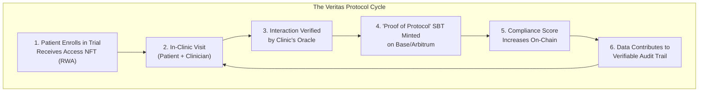
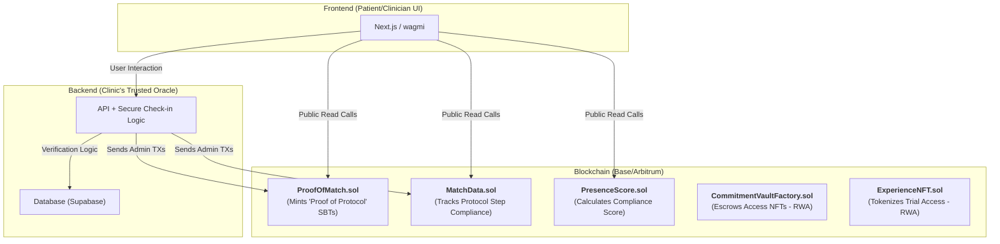

# Veritas Protocol 🧬

### An On-Chain Protocol for Verifiable Clinical Audit Trails.

*A project for the DeSci Builders Hackathon, building for the Infinita/Próspera jurisdiction.*

---

**Key Links:**
* **Live Demo:** `#`
* **Video Pitch (3-4 min):** `#`
* **Repository:** `#`

---

## 1. The Problem: Scientific Data is Opaque and Siloed

The foundation of scientific progress is trust, yet the processes for clinical trials and research are notoriously opaque. Data is siloed, patient adherence is difficult to track, and audit trails are often centralized and susceptible to error or manipulation. This lack of verifiable data integrity slows down innovation, increases costs, and creates barriers for open, reproducible science.

For pioneering jurisdictions like Próspera, which aim to accelerate biotech innovation, a new trust layer is needed to ensure the integrity of alt-regulatory clinical trials and experimental care models.

---

## 2. Our Solution: "Proof of Protocol" - Verifiable On-Chain Compliance

**Veritas** is a modular, on-chain protocol that creates immutable audit trails for real-world scientific interactions. We transform critical, offline events into verifiable on-chain credentials, building a new foundation of trust for Decentralized Science (DeSci).

Instead of relying on centralized databases, Veritas uses Soulbound Tokens (SBTs) to certify each step of a scientific protocol. When a patient meets a clinician for a scheduled trial event, our oracle verifies the interaction, and an SBT is minted to the patient's wallet. This **"Proof of Protocol" (PoP)** token is a timestamped, unforgeable credential certifying their adherence.



---

## 3. Core Features & Hackathon Tracks

Veritas is designed to directly address the core themes of the DeSci Builders Hackathon, providing a robust framework for building the future of science.

* **Verification & Audit Trails for Science (Core Feature):**
    Our protocol’s primary function is to create a transparent and immutable log of clinical trial interactions. Each minted "Proof of Protocol" SBT serves as a verifiable entry in a decentralized audit trail, proving a specific patient and clinician completed a specific step at a specific time.

* **Tokenized Patient Access & Sponsorship (RWA Implementation):**
    The `ExperienceNFT` contract allows research DAOs, biotech startups, or sponsors to fund and manage trial participation. An NFT can represent a patient's sponsored slot in a trial—a **Real-World Asset (RWA)** that grants access to care. Our `CommitmentVault` contract can be used to escrow these NFTs, ensuring they are redeemed only upon the patient's verified first visit.

* **Data Protocols for Longevity & Health:**
    The `PresenceScore` contract is repurposed as a **Compliance Score**. It quantifies a patient's adherence to a protocol. This pseudonymous score becomes a valuable new data primitive. Researchers can identify highly compliant cohorts for future studies without compromising individual patient privacy, and patients can leverage their high score to gain access to cutting-edge trials.

---

## 4. Architecture & Tech Stack

Our system is built on a modular, multi-contract architecture that separates concerns for maximum security and upgradability.



---

* **Frontend (`Next.js / Scaffold-ETH 2`):** A clean, intuitive PWA for patients and clinicians to manage trial participation and view their on-chain history.
* **Backend (`Node.js / Serverless`):** A trusted oracle, operated by the clinical institution, that verifies in-person visits (e.g., via a secure QR code scan) before triggering on-chain transactions.
* **Blockchain (`Solidity / Base / Arbitrum`):** Our smart contracts are deployed on a low-cost L2 to make audit trails affordable and scalable. The architecture includes:
    * **`ProofOfMatch.sol`**: The core registry for minting "Proof of Protocol" SBTs.
    * **`MatchData.sol`**: Tracks the evolving state of a participant's journey through a trial.
    * **`PresenceScore.sol`**: The reputation layer that calculates a patient's Compliance Score.
    * **`ExperienceNFT.sol`**: The RWA contract that tokenizes trial access.
    * **`CommitmentVaultFactory.sol`**: Creates secure escrows for sponsored access NFTs.

---

## 5. ✅ Hackathon Deliverables Checklist

| Item                                                                 | Status |
| :------------------------------------------------------------------- | :----: |
| **Multi-Contract Architecture** deployed on a public testnet (Base/Arbitrum) |   ✔︎    |
| **On-Chain Audit Trail** flow with SBT minting via a simulated oracle |   ✔︎    |
| **Evolving Compliance Score** logic implemented and readable on-chain |   ✔︎    |
| **RWA Flow** for Tokenized Patient Access demonstrated                           |   ✔︎    |
| **Functional UI** to simulate patient and clinician interaction        |   ✔︎    |
| **Video Pitch** and complete `README.md`                             |   ✔︎    |


---

## 6. Real-World Potential & Vision

Veritas is more than a hackathon project; it's a foundational layer for a new era of open science. By bringing verifiable audit trails on-chain, we can:
* Increase the transparency and trustworthiness of clinical trials conducted in flexible jurisdictions like Próspera.
* Empower patients with ownership over their participation history.
* Create new, efficient markets for sponsoring research.
* Provide researchers with novel data on patient compliance to design better trials.

Our vision is to become the default protocol for verifying real-world interactions in DeSci, building the trust infrastructure for the future of biotech.

---

## 7. 🔨 Quick Start (Local Development)

```bash
# 1. Clone the repository
git clone <YOUR_REPO_URL>
cd <PROJECT_NAME>

# 2. Install dependencies
yarn install

# 3. Start the local chain and deploy contracts
yarn chain
yarn deploy

# 4. Start the Next.js application
yarn start
```

---

### Sección 9: Equipo y Licencia

## 8. 👥 Team

| Name                | Role                           | Github / Social                          |
| :-------------------- | :---------------------------- | :--------------------------------------- |
| **Oscar Fonseca** | Full-Stack / Smart Contracts | [@edsphinx](https://github.com/edsphinx) |
| **Claudia Gutierrez** | UI/UX / Frontend              | [@Smiley](https://warpcast.com/smiley)   |

## 9. ✍️ License

MIT – see `LICENSE`.