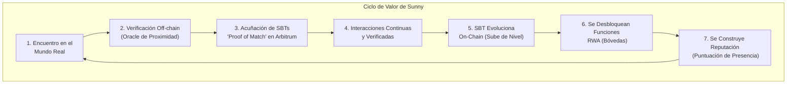
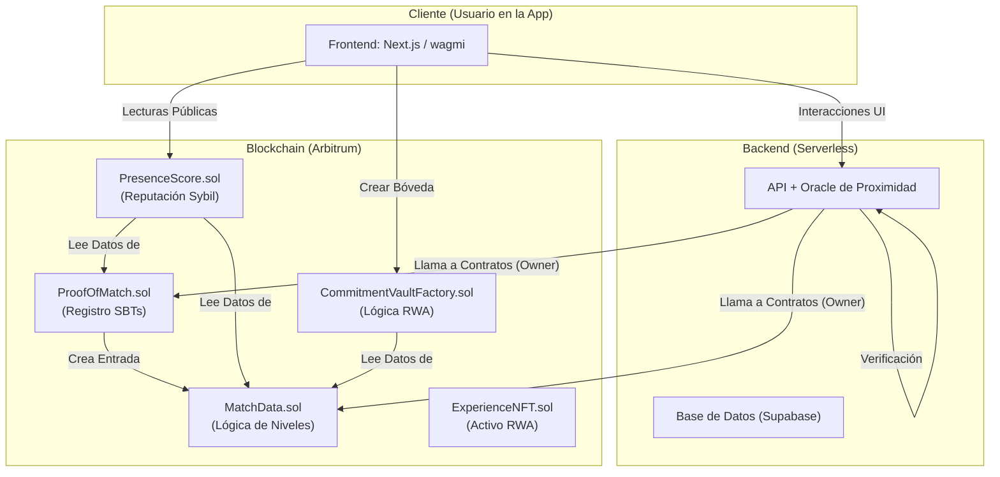

# Sunny ☀️

### El Protocolo que Transforma Interacciones Reales en Valor Digital Verificable.

*Un proyecto para la Hackathon ETH Uruguay 2025 - Categoría RWA, patrocinado por Arbitrum.*

---

**Enlaces Clave:**
* **Demo en Vivo:** `#`
* **Video Pitch (3-4 min):** `#`
* **Repositorio:** `#`

---

## Contratos Desplegados en Arbitrum Sepolia 🔗

Todos los contratos del protocolo están desplegados y verificados en la red de pruebas Arbitrum Sepolia. Puedes revisar el código fuente verificado, leer el estado del contrato y ver todas las transacciones en los siguientes enlaces de Arbiscan:

| Contrato | Dirección (Address) en Arbiscan | Descripción |
| :--- | :--- | :--- |
| **ProofOfMatch.sol** | [`0x88f9...1D14`](https://sepolia.arbiscan.io/address/0x88f9f78f8AD5Ac224ec48Fef7F345299e7411D14) | El núcleo del protocolo. Acuña los SBTs de "Prueba de Conexión". |
| **MatchData.sol** | [`0x87DF...2643`](https://sepolia.arbiscan.io/address/0x87DFa5646f097F52448A93f273AB835974d72643) | Almacena y gestiona los datos evolutivos de cada conexión (niveles, interacciones). |
| **PresenceScore.sol** | [`0x92e0...8324`](https://sepolia.arbiscan.io/address/0x92e04D680232dA68E1086B4D6E4a336533138324) | Calcula la Puntuación de Presencia para la reputación on-chain y resistencia a Sybil. |
| **CommitmentVaultFactory.sol**| [`0xB6eD...4c8`](https://sepolia.arbiscan.io/address/0xB6eD305e9a5F91E02184c8504bEAdF581C41C4c8) | Fábrica que crea las "Bóvedas de Compromiso" para asegurar las recompensas RWA. |
| **ExperienceNFT.sol** | [`0x4A04...8aDc`](https://sepolia.arbiscan.io/address/0x4A0466Bc28b54FB3cB7c1a4A91cc5a8895f58aDc) | Ejemplo de un contrato RWA que tokeniza un servicio (voucher) de un negocio. |
| **CommitmentVault.sol** | [`0x99d7...b407`](https://sepolia.arbiscan.io/address/0x99d73a610cf18C55a28b609034c7B40594D0b407) | Instancia 'plantilla' desplegada para que el frontend pueda acceder al ABI e interactuar con las bóvedas dinámicas. |

---

## 1. El Problema: La Confianza en el Mundo Digital Está Rota

En la era de las redes sociales, nuestras conexiones son abundantes pero frágiles. Las plataformas están llenas de perfiles falsos, bots y "catfishing". Una interacción digital —un *like*, un *match*, un mensaje— carece de peso y verificación en el mundo real.

Esta desconexión crea un ecosistema de baja confianza donde es imposible distinguir las conexiones genuinas de las efímeras. Para DAOs, dApps y comunidades, esto se traduce en un problema masivo: los **ataques Sybil**, donde una sola persona con mil perfiles falsos puede simular una comunidad y explotar el sistema.

## 2. Nuestra Solución: "Proof of Presence" - Prueba de Presencia Real

Sunny es un protocolo de identidad social que actúa como un puente entre el mundo físico y el digital. En lugar de basar la identidad en datos biométricos, la construimos sobre un pilar más humano: **las interacciones reales y verificadas**.

Creamos un sistema donde cada encuentro físico verificado entre dos personas se registra on-chain como un **Soulbound Token (SBT)** intransferible. Este SBT no es una simple imagen; es la primera pieza de una identidad digital que **evoluciona con la relación**, ganando niveles y reputación a medida que las interacciones continúan.

Construimos un ciclo de valor donde la confianza no se asume, se demuestra.



---

### Sección 4: El Diferenciador RWA

## 3. La "Bóveda de Compromisos": Nuestro Diferenciador RWA Clave

Verificar el pasado es solo el comienzo. El verdadero valor de Sunny reside en su capacidad para asegurar el futuro de una relación con valor del mundo real (RWA). Aquí es donde introducimos la **"Bóveda de Compromisos"**.

* **El Activo (RWA):** Negocios locales (restaurantes, hoteles) tokenizan sus servicios como **"Experiencias-NFT"** en nuestro mercado. Un NFT puede representar una "Cena para dos" o un "Fin de semana en Punta del Este".
* **La Promesa On-Chain:** Un usuario puede comprar una de estas Experiencias-NFT y depositarla en una "Bóveda de Compromisos", un smart contract que se crea para la pareja.
* **La Confianza Programable:** El NFT queda bloqueado en la bóveda. Las reglas son inmutables:
    1.  **Canje Conjunto:** Para usar la experiencia, **ambos** deben firmar la transacción.
    2.  **Resolución de Disputas:** Si la relación termina, ambos pueden firmar para disolver el compromiso, y el NFT vuelve a quien lo compró.

Ya no es un "te lo prometo". Es un **compromiso con seguridad contractual**, un gesto romántico asegurado por la blockchain de Arbitrum.

---

## 4. Arquitectura y Tech Stack

Hemos diseñado una arquitectura modular y segura, separando las responsabilidades para maximizar la flexibilidad y minimizar los riesgos.



* **Frontend (`Next.js / Scaffold-ETH 2`):** Una PWA rápida y reactiva construida con wagmi para una interacción fluida con la blockchain.
* **Backend (`Node.js / Serverless`):** Actúa como nuestro **oráculo de confianza**, verificando la proximidad de los usuarios antes de autorizar las transacciones on-chain.
* **Blockchain (`Solidity / Arbitrum`):** Nuestra infraestructura de smart contracts vive en Arbitrum para garantizar transacciones rápidas y de bajo costo, esenciales para una aplicación social.
    * **`ProofOfMatch.sol`**: El núcleo. Acuña los SBTs y asegura su intransferibilidad.
    * **`MatchData.sol`**: El "cerebro" de la relación. Almacena los niveles y el número de interacciones.
    * **`PresenceScore.sol`**: La capa de reputación. Lee los datos de los otros contratos para generar una puntuación anti-Sybil.
    * **`ExperienceNFT.sol`**: El contrato RWA que representa un voucher o servicio del mundo real.
    * **`CommitmentVaultFactory.sol`**: La fábrica que permite a los usuarios crear sus "promesas" on-chain.

---

### Sección 6: Flujo del Protocolo

### Flujo del Protocolo (MVP)

Para entender cómo cada pieza de nuestra arquitectura cobra vida, aquí explicamos el flujo completo desde la perspectiva de cada actor involucrado. Este ciclo demuestra cómo transformamos eventos y derechos del mundo real en activos digitales verificables y funcionales.

#### 🤵 **Actor 1: El Administrador/Oráculo del Protocolo (Backend)**

El Administrador actúa como la fuente de verdad centralizada que conecta el mundo físico con la blockchain. Para la demo, este rol lo simulamos nosotros.

1.  **Verificación de Encuentros:** Dos usuarios, Ana y Beto, se encuentran en el mundo real. Nuestro backend (el Oráculo) verifica su proximidad física a través de sus dispositivos.
2.  **Creación del Match On-Chain:** Una vez verificado el encuentro, el Administrador llama a la función `createMatch()` en el contrato **`ProofOfMatch.sol`**.
    * **Resultado:** Se acuñan dos SBTs (uno para Ana y otro para Beto) y se crea una entrada en el contrato **`MatchData.sol`** con `Nivel: 1`. La conexión inicial queda sellada e inmutable en Arbitrum.
3.  **Registro de Interacciones:** Ana y Beto siguen interactuando. El Oráculo verifica estos nuevos encuentros y llama a `recordInteraction()` en **`MatchData.sol`**.
    * **Resultado:** El `interactionCount` del match aumenta y, al alcanzar ciertos umbrales, el `level` del match sube a 2, y luego a 3. Su relación evoluciona on-chain.

#### 🏨 **Actor 2: Los Negocios del Mundo Real (Socios RWA)**

Los negocios locales son fundamentales para aportar valor tangible al ecosistema.

1.  **Tokenización de Servicios:** Un hotel de Punta del Este utiliza nuestro sistema para desplegar su propio contrato **`ExperienceNFT.sol`**. Luego, llama a la función `mintExperience()` para crear un NFT que representa "Una Noche para Dos". Este NFT es un RWA: un derecho verificable a un servicio real.
2.  **Venta en el Mercado:** El hotel pone a la venta este NFT en un mercado o directamente a sus clientes.

#### 👩‍❤️‍👨 **Actor 3: Los Usuarios Finales (Ana y Beto)**

Aquí es donde el protocolo demuestra su valor para la comunidad.

1.  **Construcción de Reputación:** Ana y Beto, gracias a sus interacciones, ahora tienen un SBT de Nivel 3. Cualquier dApp puede consultar el contrato **`PresenceScore.sol`** para verificar su "Puntuación de Presencia", probando que son usuarios reales y socialmente activos. Esto les da acceso a airdrops más justos, mejor poder de voto en DAOs, etc.
2.  **Adquisición del RWA:** Beto compra el NFT del hotel para sorprender a Ana. El NFT ahora está en la wallet de Beto.
3.  **Creación del Compromiso On-Chain:** Beto llama a `createCommitmentVault()` en el contrato **`CommitmentVaultFactory.sol`**.
    * **Verificación:** La fábrica primero consulta a **`MatchData.sol`** para confirmar que el match de Ana y Beto tiene al menos Nivel 2.
    * **Resultado:** Se despliega un nuevo contrato **`CommitmentVault.sol`** que pertenece a ambos. El NFT del hotel se transfiere de la wallet de Beto y queda bloqueado dentro de esta nueva bóveda. La promesa ahora es un hecho verificable en la blockchain.
4.  **Canje de la Experiencia:** Para su aniversario, Ana y Beto deciden usar la experiencia.
    * **Acuerdo:** Ambos llaman a `approveRedemption()` desde sus respectivas wallets en su `CommitmentVault`.
    * **Ejecución:** Uno de ellos llama a `executeRedemption()`. El contrato verifica ambas aprobaciones y les transfiere el NFT a su wallet.
    * **Resultado Final:** Pueden presentar el NFT en el hotel para canjear su estancia. Han completado el ciclo completo, llevando un compromiso digital a una experiencia en el mundo real.

---

## 5. ✅ Checklist de Entregables del Hackathon

| Item | Status |
| :--- | :---: |
| **Arquitectura Multi-Contrato** funcional desplegada en Arbitrum Sepolia | ✔︎ |
| **Flujo de Acuñación de SBTs** basado en un oráculo simulado | ✔︎ |
| **Lógica de SBTs Evolutivos** (Niveles) funcional | ✔︎ |
| **Protocolo `PresenceScore`** para resistencia a Sybil | ✔︎ |
| **Flujo RWA de "Bóveda de Compromisos"** funcional | ✔︎ |
| **UI de prueba** para demostrar todo el flujo | ✔︎ |
| **MVP** y `README.md` completo | ✔︎ |

## 6. Modelo de Negocio y Valor RWA

Sunny genera valor de tres formas:

1.  **Comisión del Mercado de Experiencias:** Cobramos un pequeño porcentaje por cada Experiencia-NFT vendida por los negocios asociados.
2.  **Fee por Creación de Bóvedas:** Un fee mínimo cada vez que un usuario crea una "Bóveda de Compromisos", un servicio de alto valor emocional y contractual.
3.  **API de Presence Score (Futuro):** Licenciar el acceso a la Puntuación de Presencia a otros proyectos que necesiten una solución de resistencia a Sybil.

Nuestra solución aporta **valor RWA real** al tokenizar dos cosas: **eventos pasados** (el match) y **derechos futuros** (la experiencia), creando un puente tangible entre las acciones de los usuarios en el mundo real y su capital social y financiero en el mundo digital.

## 7. Plan de Crecimiento (Uso del Premio)

#### **Prioridad #1: Oráculo Robusto (≥ $500)**
* **Inversión:** Integración con APIs de verificación de localización (ej. Foursquare) y subsidio de gas inicial.
* **Resultado:** Pasar de un oráculo simulado a uno robusto, aumentando la confianza y cubriendo las primeras 10,000 transacciones en Arbitrum.

#### **Prioridad #2: Alianzas Comerciales (≥ $1,000)**
* **Inversión:** Lo anterior + un fondo para incentivar a los primeros 10 negocios en unirse al Mercado de Experiencias.
* **Resultado:** Crear un catálogo inicial de RWAs atractivos y demostrar el modelo de negocio.

#### **Prioridad #3: Expansión del Ecosistema (1er Lugar)**
* **Inversión:** Todo lo anterior + desarrollo de un SDK para que cualquier dApp en Arbitrum integre fácilmente el `PresenceScore`.
* **Resultado:** Convertir a Sunny de una aplicación a una **capa de infraestructura de identidad** para todo el ecosistema.

## 8. 🔨 Quick Start (Desarrollo Local)

```bash
# 1. Clonar el repositorio
git clone <URL_DE_TU_REPO>
cd <NOMBRE_DEL_PROYECTO>

# 2. Instalar dependencias
yarn install

# 3. Iniciar la cadena local y desplegar contratos
yarn chain
yarn deploy

# 4. Iniciar la aplicación de Next.js
yarn start

````

---
### Sección 11: Equipo y Licencia
```markdown
## 9. 👥 Equipo

| Nombre | Rol | Github / Social |
| :--- | :--- | :--- |
| **Oscar Fonseca** | Full-Stack / Smart Contracts | [@edsphinx](https://github.com/edsphinx) |
| **Claudia Gutierrez** | UI/UX / Frontend | [@Smiley](https://github.com/22lolo) |


## 10. ✍️ Licencia

MIT – ver `LICENSE`.

*Hecho con ♥ para ETH Uruguay 2025 y desplegado en Arbitrum.*
